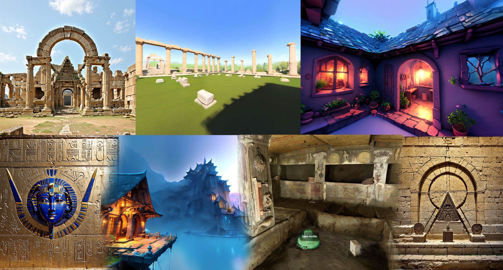

# /imagine

Generative A.I. can be used to accelerate content-creation pipelines for interactive experiences or artificial 3D landscapes users can explore using common web browsers. These virtual experiences can incorporate 3D models, audio-visual elements, and interactive storytelling, integrating multiple A.I. services. They can generate new artistic works inspired by heritage themes, blending traditional heritage elements with modern interpretations to create unique artworks. They can generate educational content such as historical narratives, text-to-speech or immersive simulations to help students and enthusiasts learn about heritage sites and their significance.
In these experiments, we combine several generative A.I. services to generate visual and auditory content, short artificial narratives; automatic translators and text-to-speech services to aurally enrich semantically annotated 3D scenes by Heritage professionals for XR consumption.

This WebXR app is a showcase of some experiments you can accesso on mobile, desktop or XR devices